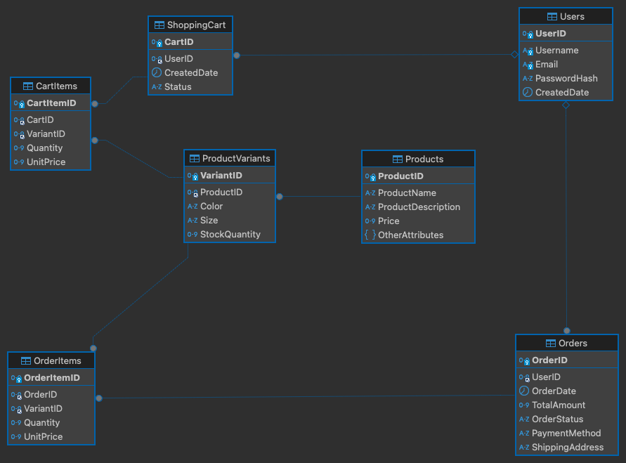

# Square One Shop API documentation

This is the documentation for the Square One Shop API, here design choices and endpoints will be explained. There will be a short description about how to run this code on a local machine.

## Relationships
This model uses the following database structure:

 

These were the relationships chosen:
- A user can only have one shopping cart, therefore it uses a one-to-one relationship.
- A shopping cart can have multiple cart items so it is a one-to-many relationship.
- A user can have multiple orders (one-to-many), which in kind can have multiple order items (one-to-many).
- A product can have many variants (size, colour, etc.) so it is a one-to-many relationship.
- An cart item can only have one variant associated therefore there is a one-to-one relationship.
- A variant can have multiple orders items associated so it is one to many.

## Endpoint Explanation
In general, for most, if not all, of these there is a try-catch exception for generic problems, this returns the code 500.
If any of these are GET methods, they usually have a 404 return if there are none of the object.
If it is succesful and it creates a model, it returns a 201, otherwise, if it is succesfull, 200 is returned (it can be an update or a normal get).

### Users
- **POST /register:** create a new user, by validating the input data and checking if the email already exists. If the data can't be validated, a 422 error message is returned.
- **POST /login:** authenticate and return access token by validating the input data. If the data can't be validated, a 422 error message is returned, if the user doesn't exist or the password doesn't match the password we return a 401.
- **GET /profile:** get authenticated user's information, must be logged in, if there is a problem with the token, it returns a 401.
- **POST /logout:** logout from the authenticated user's session, must be logged in first, if there is a issue with the token, it returns a 401.

### Shopping Cart
All of these require a user to be logged in. The sanctum middleware is used.
- **GET /cart:** See the content of the shopping cart of a logged in user. 
- **POST /cart/add:** Add a product or variant to the shopping cart.
- **PUT /cart/update/{CartItemID}:** update the quantity of a product in the shopping cart.
- **DELETE /cart/remove/{CartItemID}:** delete a product from the shopping cart returns no content if succeds.

### Products and variants
- **GET /products:** shows all available products with their variants.
- **GET /products/{ProductID}:** get details from a specific product.
- **GET /products/search:** this searches for product according to name (/products/search?name=value), color (/products/search?color=value), size(/products/search?size=value), brand (/products/search?attributes=brand&value=value), collection (/products/search?attributes=collection&value=value), min and max price (/products/search?min_price=value&max_price=value2), and gender (/products/search?attributes=gender&value=value).
Other endpoints like update and destroy were modified to allow variants, and are on the route in case they are needed.

### Orders
Again, all of these endpoints require a user to be logged in. The sanctum middleware is used.

- **POST /orders/create:** create an order with the current shopping cart, if there is no cart, we return a 404, a 400 if there are no items.
- **GET /orders:** this shows all of the user's orders.
- **GET /orders/{OrderID}:** obtain the details of a specific order.


## Run this code locally
If needed, this is to create random test SQLite dataset.
```
php artisan migrate:fresh --seed
```
It can be used to check the postman json appended in the file `SquareOneAPIStore.postman_collection`, this file, while it has the routes and such, would have to be edited to change the new bearer token for the user, an other specific things, these tests are very general. To use postman:
```
php artisan serve
```

To run the tests in this same project using the memory and not the seeded database:
```
php artisan test
```